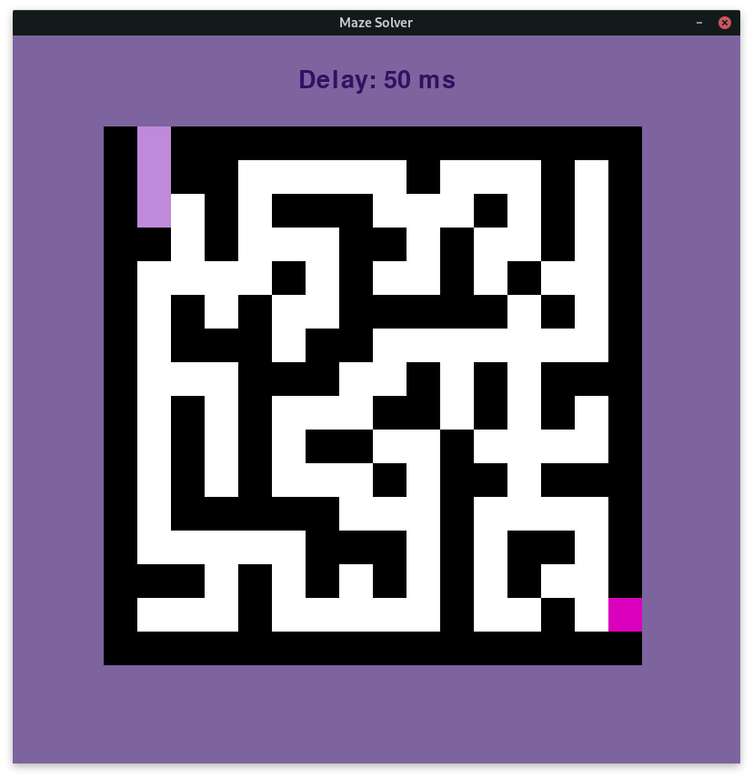
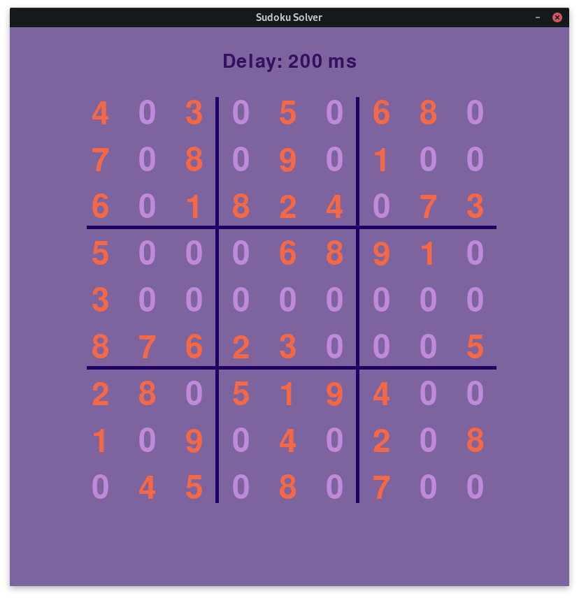

# Solver Algorithms


## Description
**Solver Algoritms** is a repository with 4 algorithms that solve 4 different problems using **Backtracking**. The 4 problems are:
- Sudoku solver
- Maze solver
- Crossword solver
- Graph Colorer

These algoritms are either provided with visual support using [pygame](https://www.pygame.org), or just with terminal output where pygame support was not possible.

## Installation

Clone the repository

```bash
git clone https://github.com/Adeon18/Solver_Algorithms.git
```

Go to the folder

```bash
cd Solver_Algorithms
```

Use the package manager [pip](https://pip.pypa.io/en/stable/) to install the needed libraries.

```bash
pip install -r requirements.txt
```

## Usage

All you need to do is run the script **main.py** in terminal or via Text Editor and you're good to go.

```bash
python -m main.py
```

You are gonna see a terminal interface like this:
```bash
Hello! This is a script launcher. Choose a number of the script you would like to run.
Before you choose, close down the program and edit the coresponding file in data folder if you want to solve your problem

    1. Maze solver
    2. Sudoku solver
    3. Crossword solver
    4. Graph Colorer

Enter a number: 
```
Algoritms take the problems from **data** folder, so if you want _your_ problem to be solved you can edit a file with the specific name.

When you choose an option you are going to end up with windows like these:




You can edit the dalay speed between each step of the algoritm using **UP** and **DOWN** keys on your keyboard.

If you did not end up with windows like these, that means that **we couldnt provide a graphical interface for the problem**. _Check your terminal :D_

Everything else is quite simple. **Enjoy!**


## Contributing

- Fork the repository
- Make your change in your forked repository
- Make a pull request and add a rewiever among us(You can see who to add below)

## Credits

- Algoritms visualization with pygame and README - [Ostap Trush](https://github.com/Adeon18)
- Crossword solver algorithm - [Olexiy Hoev](https://github.com/alexg-lviv)
- Maze solver algorithm - [Alina Muliak](https://github.com/alinamuliak)
- Graph colorer - [Daryna Kosyk](https://github.com/cosssec)
- Sudoku solver algorithm - [Daria Shabatska](https://github.com/S-Daria)


## License

[MIT](https://choosealicense.com/licenses/mit/)